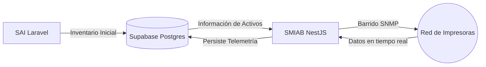

# Arquitectura del Sistema SMIAB/SAI

## 🏗️ Separación de Responsabilidades (DDD)

El ecosistema SMIAB/SAI se basa en un diseño híbrido donde cada sistema tiene una responsabilidad única y bien definida:

| Sistema | Responsabilidad | Maestro de... |
| :--- | :--- | :--- |
| **SAI (Laravel)** | Gestión de activos, áreas, resguardantes y altas masivas. | **Datos de Inventario** |
| **SMIAB (NestJS/NextJS)** | Telemetría en tiempo real, niveles de tóner, impresión y reportes. | **Telemetría y Métricas** |

### Flujo de Datos Híbrido

---

## 🛰️ Lógica del Barrido SNMP

El módulo `SnmpModule` del backend es el encargado de la recuperación de datos.

1.  **Cronjob Automático:** Se ejecuta periódicamente para actualizar el estado de todas las impresoras activas con IP asignada.
2.  **Cálculo de deltas (Consumo):** 
    -   El sistema mantiene un histórico de contadores totales de impresión.
    -   El **delta mensual** se calcula restando el contador de fin de mes del contador de inicio de mes.
    -   Si no hay registro inicial, el delta se asume como 0 para evitar picos artificiales.
3.  **Resiliencia:** Incorpora lógica de cierre automático de sockets y manejo de timeouts para evitar bloqueos del hilo principal de Node.js.

---

## 🖼️ Lógica de Visual Scraping y Reportes por Correo

Para la generación de reportes institucionales, SMIAB utiliza una estrategia de **Visual Scraping** optimizada para el flujo de trabajo humano:

-   **Formato de Salida (HTML + Screenshot):** A diferencia de un PDF estático, el sistema genera un **Correo HTML editable**. Dentro del cuerpo del correo, se incrusta una captura de pantalla (screenshot) del panel web de la impresora utilizando el protocolo **CID (Content-ID)**. 
    -   *Propósito:* Esto permite que el usuario administrativo pueda revisar el contenido y, de ser necesario, editar el texto del correo antes de reenviarlo formalmente al departamento de compras.
-   **Justificación de p-limit(1) (Embudo de Memoria):** Cada instancia de Puppeteer consume aproximadamente **200MB de RAM**. Dado que el servidor tiene recursos limitados, el uso de `p-limit(1)` actúa como un embudo técnico o cola en memoria. 
    -   *Prevención:* Esto garantiza que solo se procese un reporte a la vez, evitando el colapso del servidor por errores de **Out of Memory (OOM)** si múltiples usuarios disparan solicitudes simultáneamente.
-   **Ciclo de Vida Seguro:** Cada sesión se encapsula en un bloque `try-finally`, asegurando el cierre definitivo del navegador (`browser.close()`) tras cada ejecución.

---

> [!WARNING]
> La generación de reportes es una tarea intensiva en CPU/RAM. Se recomienda monitorizar el uso de memoria si se planea escalar a más de 100 reportes simultáneos.
